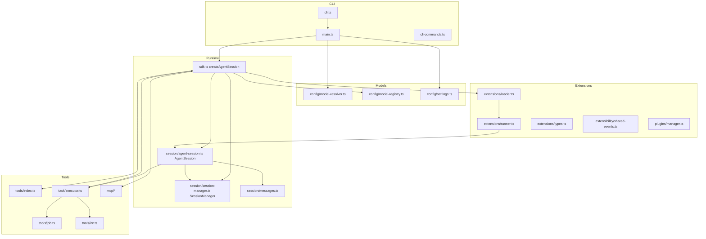
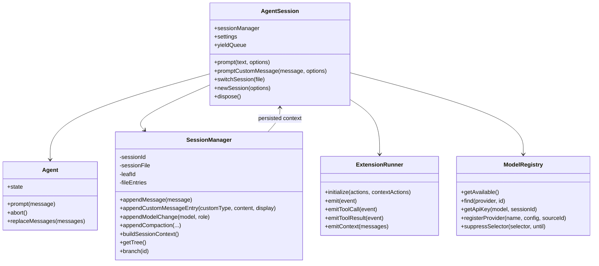
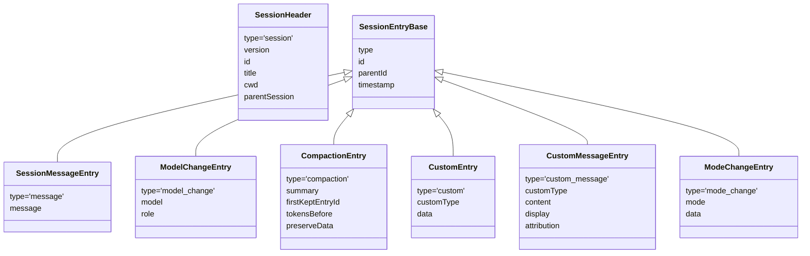
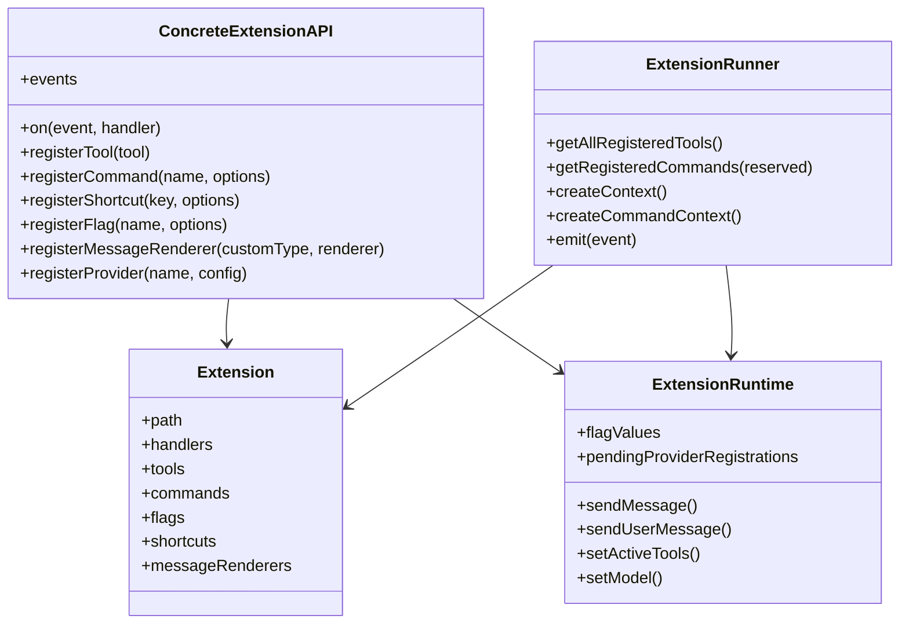
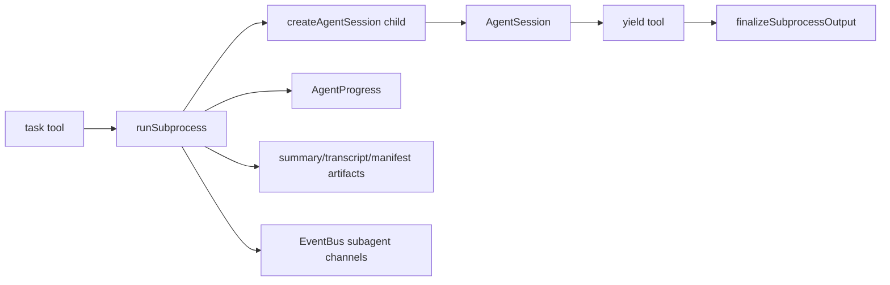

# Class and Module Diagrams

## Top-level modules

Citations: root flow (`packages/coding-agent/src/main.ts:716-1060`), SDK construction (`packages/coding-agent/src/sdk.ts:794-2166`), task executor child session creation (`packages/coding-agent/src/task/executor.ts:1277-1322`), extension loader/runner (`packages/coding-agent/src/extensibility/extensions/loader.ts:332-609`, `packages/coding-agent/src/extensibility/extensions/runner.ts:172-900`).

## Core runtime class relationships

`AgentSessionConfig` lists constructor dependencies (`packages/coding-agent/src/session/agent-session.ts:252-336`). `CreateAgentSessionOptions` and `CreateAgentSessionResult` are SDK-facing contracts (`packages/coding-agent/src/sdk.ts:234-364`).

## Session entry model

Grounding: entry contracts in `packages/coding-agent/src/session/session-manager.ts:57-253`.

## Extension API and runner

Grounding: `ConcreteExtensionAPI` (`packages/coding-agent/src/extensibility/extensions/loader.ts:120-260`), extension object creation (`packages/coding-agent/src/extensibility/extensions/loader.ts:262-275`), runner runtime (`packages/coding-agent/src/extensibility/extensions/runner.ts:172-900`).

## Task/subagent modules

Grounding: executor types (`packages/coding-agent/src/task/executor.ts:174-233`), lifecycle (`packages/coding-agent/src/task/executor.ts:615-1777`), output finalization (`packages/coding-agent/src/task/executor.ts:302-393`).
