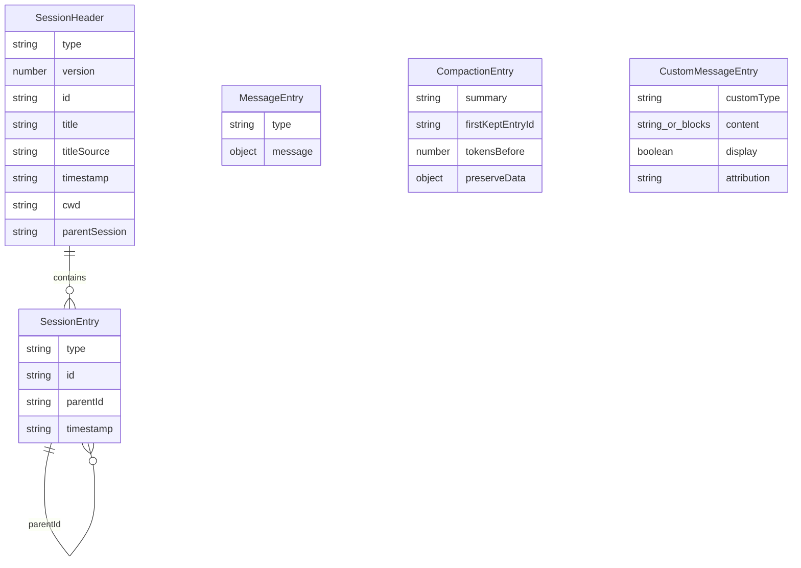

# Data Contracts

## SDK session creation

`CreateAgentSessionOptions` is the embedding contract for the runtime (`packages/coding-agent/src/sdk.ts:234-346`). Important groups:

| Group | Fields |
| --- | --- |
| workspace/config | `cwd`, `agentDir`, `settings`, `spawns` |
| auth/models | `authStorage`, `modelRegistry`, `model`, `modelPattern`, `thinkingLevel`, `scopedModels`, `providerSessionId` |
| discovery | `customTools`, `extensions`, `additionalExtensionPaths`, `disableExtensionDiscovery`, `preloadedExtensions`, `skills`, `rules`, `contextFiles`, `workspaceTree`, `promptTemplates`, `slashCommands` |
| tools | `enableMCP`, `mcpManager`, `enableLsp`, `skipPythonPreflight`, `toolNames`, `requireYieldTool` |
| subagent/session | `outputSchema`, `taskDepth`, `parentHindsightSessionState`, `agentId`, `agentDisplayName`, `agentRegistry`, `parentTaskPrefix`, `parentEvalSessionId`, `sessionManager`, `localProtocolOptions` |
| UI/telemetry | `hasUI`, `telemetry` |

`CreateAgentSessionResult` returns `session`, `extensionsResult`, `setToolUIContext()`, optional `mcpManager`, optional `modelFallbackMessage`, optional `lspServers`, and shared `eventBus` (`packages/coding-agent/src/sdk.ts:348-364`).

## Session JSONL entries

Every persistent session starts with `SessionHeader` and appends `SessionEntry` records (`packages/coding-agent/src/session/session-manager.ts:57-253`).

Key invariants:

- `parentId` defines conversation tree; active branch is the path from current leaf to root (`packages/coding-agent/src/session/session-manager.ts:2880-2897`).
- `CustomEntry` persists extension state but does not enter LLM context (`packages/coding-agent/src/session/session-manager.ts:130-144`).
- `CustomMessageEntry` enters LLM context and display pipeline (`packages/coding-agent/src/session/session-manager.ts:189-209`, `packages/coding-agent/src/session/session-manager.ts:2718-2741`).
- `buildSessionContext()` returns messages, thinking level, service tier, model role map, injected TTSR rules, selected MCP tools, persisted-selection flag, mode, and mode data (`packages/coding-agent/src/session/session-manager.ts:506-761`).

## Agent messages and LLM conversion

`session/messages.ts` defines internal message variants for custom, hook, bash/python execution, and file mention messages. `convertToLlm()` is the boundary that maps those internal messages to provider-facing `Message[]` (`packages/coding-agent/src/session/messages.ts:221-294`, `packages/coding-agent/src/session/messages.ts:367-473`).

Notable boundaries:

- bash/python messages can be excluded from context;
- branch and compaction summaries are rendered as user-context wrappers;
- file mentions become a system-reminder user message plus image blocks;
- `stripInternalDetailsFields()` removes transient internal fields before custom-message persistence (`packages/coding-agent/src/session/messages.ts:36-104`, `packages/coding-agent/src/session/session-manager.ts:2718-2741`).

## Task contracts

Task input contracts are in `packages/coding-agent/src/task/types.ts`:

- task params: `agent`, `tasks[]`, `context`, `schema`, and optional isolation controls;
- `AgentProgress`: current status/tool/recent output/token/cost/metadata view;
- `SingleResult`: terminal result with output/stderr/truncation/usage/artifacts/extracted tool data;
- `TaskToolDetails`: aggregate result surfaced to parent tool result.

`runSubprocess()` writes optional transcript, summary, and manifest artifacts. `buildAgentRunManifest()` normalizes raw output into `summary`, `deliverables`, `openQuestions`, and `nextActions` fields when possible (`packages/coding-agent/src/task/executor.ts:431-467`, `packages/coding-agent/src/task/executor.ts:1671-1728`).

## Extension contracts

Extension API types live in `packages/coding-agent/src/extensibility/extensions/types.ts`:

| Contract | Source |
| --- | --- |
| UI surface | `ExtensionUIContext`, `packages/coding-agent/src/extensibility/extensions/types.ts:137-232` |
| runtime handler context | `ExtensionContext`, `packages/coding-agent/src/extensibility/extensions/types.ts:259-286` |
| command context | `ExtensionCommandContext`, `packages/coding-agent/src/extensibility/extensions/types.ts:296-323` |
| tools | `ToolDefinition`, `packages/coding-agent/src/extensibility/extensions/types.ts:350-392` |
| events | `ExtensionEvent`, `packages/coding-agent/src/extensibility/extensions/types.ts:706-736` |
| provider registration | `ProviderConfig`, `ProviderModelConfig`, `packages/coding-agent/src/extensibility/extensions/types.ts:1055-1114` |
| loaded extension | `Extension`, `LoadExtensionsResult`, `packages/coding-agent/src/extensibility/extensions/types.ts:1230-1248` |

Shared event/result contracts are in `packages/coding-agent/src/extensibility/shared-events.ts:27-344`.

## Model config contracts

`models-config-schema.ts` defines external model/provider config shapes: OpenAI-compatible provider options, model thinking metadata, model definitions and overrides, provider discovery/auth options, provider config, equivalence config, and full models config (`packages/coding-agent/src/config/models-config-schema.ts:21-174`).

Resolver-facing contracts:

- `ScopedModel`: `{ model, thinkingLevel?, explicitThinkingLevel? }` (`packages/coding-agent/src/config/model-resolver.ts:26-30`);
- `ResolvedModelRoleValue`: concrete model plus thinking metadata and warning (`packages/coding-agent/src/config/model-resolver.ts:663-710`);
- `ResolveCliModelResult`: model/selector/thinking/warning/error (`packages/coding-agent/src/config/model-resolver.ts:1071-1232`).

## SQL and Redis session storage

Alternate session storage adapters implement the same file-like `SessionStorage` behavior with process-local mirrors for sync APIs.

### SQL

- Table defaults to `omp_session_files`.
- Columns: `path` primary key, `content`, `mtime_ms`.
- Dialects: postgres, mysql, sqlite.
- Table name is allowlisted because it is interpolated into DDL/query strings.
- Sync reads/listing use mirror; writes update mirror synchronously then queue DB writes.

Sources: `packages/coding-agent/src/session/sql-session-storage.ts` symbols `SqlSessionStorageOptions`, `buildQueries()`, `SqlSessionStorage`, `SqlSessionStorageWriter`.

### Redis

- File bytes are Redis string keys `${prefix}file:${path}`.
- Mtimestamps are fields in hash `${prefix}meta`.
- Default prefix is `omp:sessions:`.
- `create()` scans/warns mirror; sync reads/listing use mirror; queued writes are awaited by `flush()`/`close()`/`drain()`.

Sources: `packages/coding-agent/src/session/redis-session-storage.ts` symbols `RedisSessionStorageOptions`, `RedisSessionStorage`, `RedisSessionStorageWriter`.

## AgentStorage SQLite

`AgentStorage` is persistent SQLite for model usage order, legacy settings migration, auth credentials, and auth cache. It is singleton per DB path, opens `getAgentDbPath()` by default, creates parent dir, initializes schema, and hardens permissions to directory `0700` and DB `0600` (`packages/coding-agent/src/session/agent-storage.ts`).
