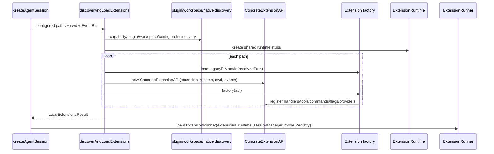
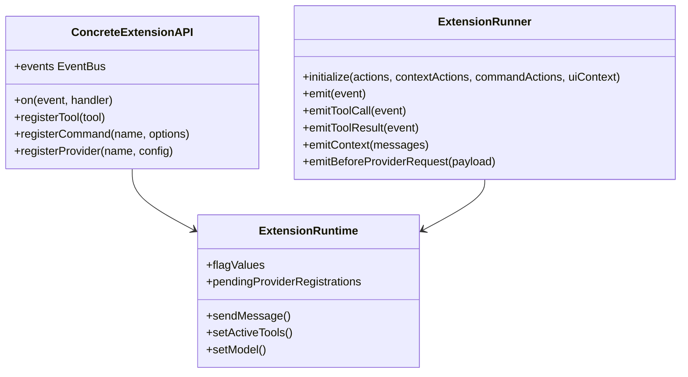

# Extension, Plugin, and EventBus Architecture

The extension system has two different event concepts:

- **Core lifecycle events** are delivered by `ExtensionRunner` directly to handlers registered with `pi.on(...)`.
- **Shared `EventBus`** is exposed to extension code as `pi.events` for extension-to-extension or tool/extension communication. Core lifecycle dispatch does not use this bus (`packages/coding-agent/src/extensibility/extensions/loader.ts:18`, `packages/coding-agent/src/extensibility/extensions/loader.ts:131-137`, `packages/coding-agent/src/extensibility/extensions/loader.ts:332-356`).

## Loading pipeline

Citations: `ConcreteExtensionAPI` registration/action bridge (`packages/coding-agent/src/extensibility/extensions/loader.ts:120-260`); module loading (`packages/coding-agent/src/extensibility/extensions/loader.ts:278-327`); path discovery (`packages/coding-agent/src/extensibility/extensions/loader.ts:388-609`).

## Registration-time vs runtime actions

During loading, extensions can register handlers, tools, commands, shortcuts, flags, message renderers, and providers. Runtime actions like `sendMessage()`, `setActiveTools()`, and `setModel()` initially throw `ExtensionRuntimeNotInitializedError` until `ExtensionRunner.initialize()` replaces stubs with session-bound implementations (`packages/coding-agent/src/extensibility/extensions/loader.ts:47-113`, `packages/coding-agent/src/extensibility/extensions/runner.ts:210-268`).

## Runtime dispatch semantics

`ExtensionRunner` isolates handler failures and applies per-handler timeout for most event types (`packages/coding-agent/src/extensibility/extensions/runner.ts:498-535`). Generic `emit()` walks extensions in load order; cancellable session-before events short-circuit only when a handler returns `cancel` (`packages/coding-agent/src/extensibility/extensions/runner.ts:538-569`).

Specialized emitters have event-specific transformation rules:

| Method | Contract | Source |
| --- | --- | --- |
| `emitToolCall()` | handlers can block tool execution; handler throw blocks with error reason | `packages/coding-agent/src/extensibility/extensions/runner.ts:614-647` |
| `emitToolResult()` | handlers can replace content/details/isError cumulatively | `packages/coding-agent/src/extensibility/extensions/runner.ts:571-612` |
| `emitInput()` | text/images transform chain; `handled` short-circuits | `packages/coding-agent/src/extensibility/extensions/runner.ts:727-751` |
| `emitContext()` | clones messages only if context handlers exist; handlers can replace message array | `packages/coding-agent/src/extensibility/extensions/runner.ts:753-797` |
| `emitBeforeProviderRequest()` | payload transform chain | `packages/coding-agent/src/extensibility/extensions/runner.ts:799-826` |
| `emitBeforeAgentStart()` | can append custom messages and replace system prompt | `packages/coding-agent/src/extensibility/extensions/runner.ts:848-899` |

## Lifecycle event surface

Shared session/agent events live in `shared-events.ts`:

- session: start, before/after switch, branch, compact, shutdown, tree navigation, goal update (`packages/coding-agent/src/extensibility/shared-events.ts:27-151`);
- agent/turn: context, agent start/end, turn start/end (`packages/coding-agent/src/extensibility/shared-events.ts:153-197`);
- maintenance: auto-compaction, auto-retry, TTSR, todo reminders (`packages/coding-agent/src/extensibility/shared-events.ts:199-255`);
- tool/session result contracts (`packages/coding-agent/src/extensibility/shared-events.ts:261-344`).

Extension-specific events and API types are in `types.ts`, including UI context, command context, tool definition, provider config, and `ExtensionEvent` union (`packages/coding-agent/src/extensibility/extensions/types.ts:137-1248`).

## Credential-disabled buffering

Credential invalidation can occur during startup model probes before UI/runtime actions are wired. `createAgentSession()` subscribes to `AuthStorage` early and buffers events until an `ExtensionRunner` exists (`packages/coding-agent/src/sdk.ts:814-827`, `packages/coding-agent/src/sdk.ts:1466-1478`). `ExtensionRunner.emitCredentialDisabled()` buffers up to 32 events before `initialize()`, then drains after runtime/UI context is installed (`packages/coding-agent/src/extensibility/extensions/runner.ts:191-198`, `packages/coding-agent/src/extensibility/extensions/runner.ts:253-293`).

## Plugin manager role

Plugin manager code handles install/uninstall/link/list/enable/settings/doctor surfaces and exposes installed plugin extension paths to the extension loader. It is package-management and discovery support, not the lifecycle dispatcher (`packages/coding-agent/src/extensibility/plugins/manager.ts`, `packages/coding-agent/src/extensibility/extensions/loader.ts:573-577`).
