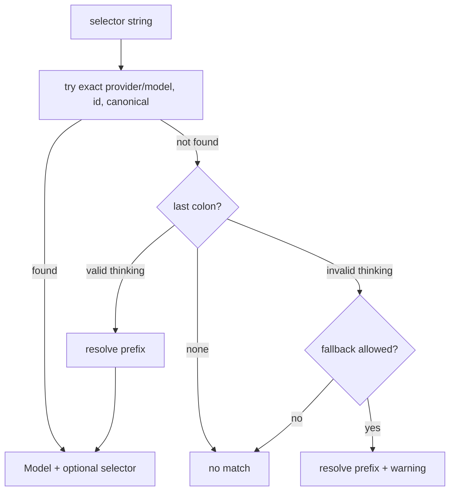
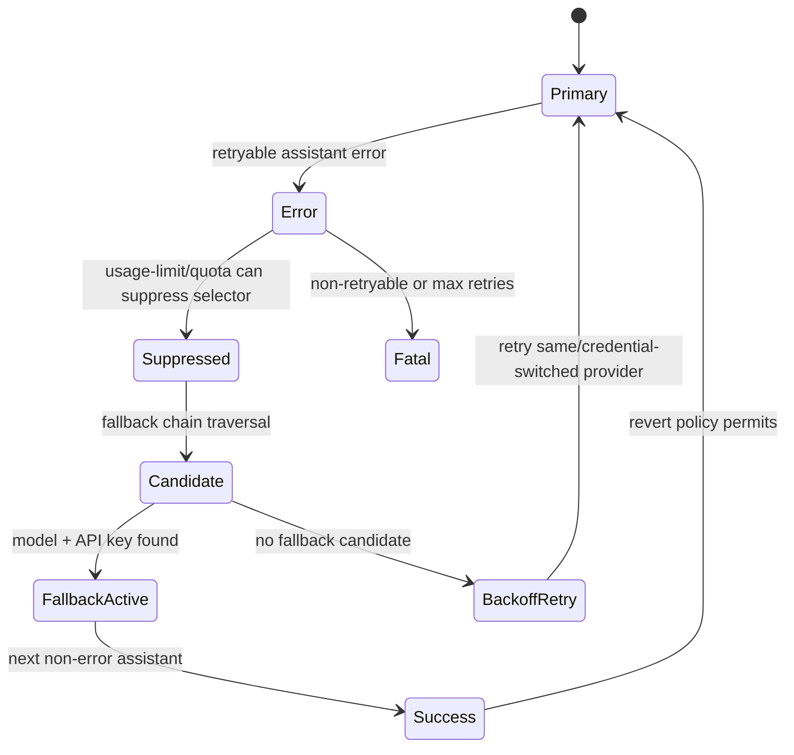

# Model Resolution and Fallback

Model selection spans CLI parsing, settings profiles, model registry availability, extension-provided providers, session restoration, subagent overrides, retry fallbacks, and compaction/context-promotion candidates.

## Selector grammar

- Persisted model strings use `provider/modelId` (`formatModelString()`, `packages/coding-agent/src/config/model-resolver.ts:58-60`).
- Selectors may include thinking suffixes like `provider/model:high`. The resolver splits only a valid thinking suffix from the last colon; invalid suffix fallback can warn and drop the suffix depending on caller options (`packages/coding-agent/src/config/model-resolver.ts:470-535`).
- CLI `--provider` and `--model` are resolved by `resolveCliModel()` with provider normalization, exact provider/model preference, canonical aliases, and pattern matching (`packages/coding-agent/src/config/model-resolver.ts:1082-1232`).

## Session startup resolution

`main.ts` resolves scoped model lists before session creation, using enabled model patterns and model usage preferences (`packages/coding-agent/src/main.ts:858-871`). `buildSessionOptions()` then applies precedence (`packages/coding-agent/src/main.ts:547-707`):

1. explicit CLI `--model` / `--provider`;
2. remembered default role when scoped models exist and not continuing/resuming;
3. first scoped model;
4. CLI `--thinking` or scoped/default thinking level;
5. deferred `modelPattern` if CLI model cannot be found before extensions and provider was omitted.

`createAgentSession()` applies runtime precedence (`packages/coding-agent/src/sdk.ts:923-999`, `packages/coding-agent/src/sdk.ts:1402-1443`):

1. restore model from existing session when no explicit model was requested;
2. settings default role from `resolveModelRoleValue()`;
3. extension provider registrations, then deferred `modelPattern`;
4. first allowed model with usable API key;
5. no model with `modelFallbackMessage`.

## Enabled model scope

`resolveModelScope()` expands exact selectors, canonical groups, and glob patterns with optional thinking levels. It deduplicates by provider/id and preserves explicit thinking metadata (`packages/coding-agent/src/config/model-resolver.ts:934-1039`).

`resolveAllowedModels()` starts from `modelRegistry.getAvailable()` and filters by `settings.enabledModels` when configured. Empty enabled-model matches deliberately return an empty list; callers must not silently fall back to global default (`packages/coding-agent/src/config/model-resolver.ts:1041-1069`).

## Extension provider registration

Extensions can call `registerProvider()` during loading; registrations queue in `ExtensionRuntime.pendingProviderRegistrations` (`packages/coding-agent/src/extensibility/extensions/loader.ts:257-259`). `createAgentSession()` processes them before deferred `--model` resolution and before first-available fallback (`packages/coding-agent/src/sdk.ts:1372-1417`). It also re-resolves scoped models so Ctrl+P cycling includes extension-provided models (`packages/coding-agent/src/sdk.ts:1386-1399`).

## Subagent model resolution

Task subagents resolve agent/model overrides through `resolveModelOverrideWithAuthFallback()` (`packages/coding-agent/src/task/executor.ts:1201-1227`, `packages/coding-agent/src/config/model-resolver.ts:827-868`). If the subagent-selected model has no usable auth and the parent active model resolves with auth, the subagent uses the parent model. Keyless local providers using `kNoAuth` are treated as authenticated and are not silently rerouted.

## Retry fallback state machine

Retry events are part of `AgentSessionEvent`: `auto_retry_start`, `auto_retry_end`, `retry_fallback_applied`, and `retry_fallback_succeeded` (`packages/coding-agent/src/session/agent-session.ts:226-229`).

Key mechanics:

- `#isRetryableError()` handles transient transport/envelope failures, usage-limit errors, and Antigravity quota exhaustion; context overflow is excluded because compaction owns it (`packages/coding-agent/src/session/agent-session.ts:6950-7008`).
- `#handleRetryableError()` applies retry settings, credential switching/suppression, model fallback, backoff, removal of terminal error assistant, and scheduled continuation (`packages/coding-agent/src/session/agent-session.ts:7462-7556`).
- `#applyRetryFallbackCandidate()` requires a resolved model and API key, switches current model, appends temporary `model_change`, records usage, adjusts thinking level, tracks original selector, and emits `retry_fallback_applied` (`packages/coding-agent/src/session/agent-session.ts:7298-7333`).
- Success emits `retry_fallback_succeeded` and `auto_retry_end(success=true)` on the next non-error assistant message (`packages/coding-agent/src/session/agent-session.ts:1688-1703`).

## Context promotion and compaction fallback

Before compaction, context overflow/incomplete/threshold paths can try a larger model configured for context promotion. If a candidate model and API key exist, the session temporarily switches model and continues (`packages/coding-agent/src/session/agent-session.ts:6118-6185`). If promotion is not available, auto-compaction runs and emits auto-compaction events around the summary/write/replay flow (`packages/coding-agent/src/session/agent-session.ts:6561-6868`).

## Registry and profile boundaries

`ModelRegistry` owns static, cached, custom, runtime-discovered, and extension-registered models; availability is credential/provider filtered. It also records canonical variants and selector suppression used by fallback paths (`packages/coding-agent/src/config/model-registry.ts`).

`Settings` supports active model profiles and profile-scoped paths. Profile overlay is applied during settings merge, and model role accessors read/write the active profile where appropriate (`packages/coding-agent/src/config/settings.ts:116-148`, `packages/coding-agent/src/config/settings.ts:486-600`, `packages/coding-agent/src/config/settings.ts:917-939`).
