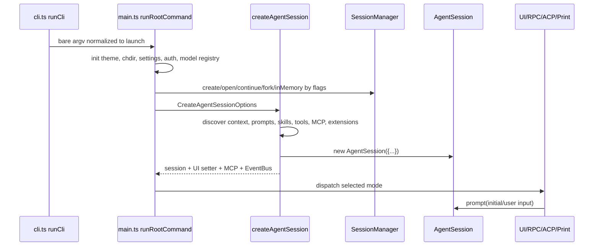
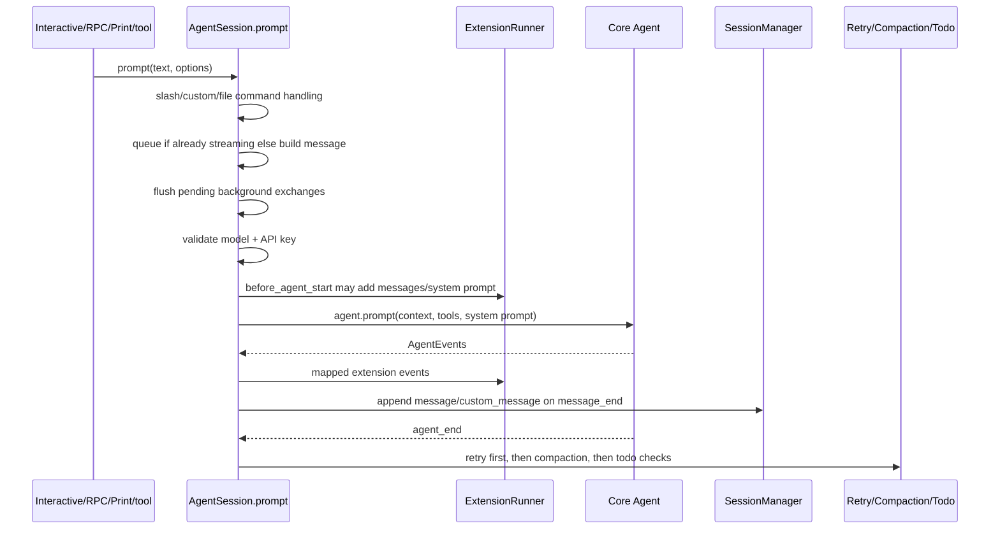
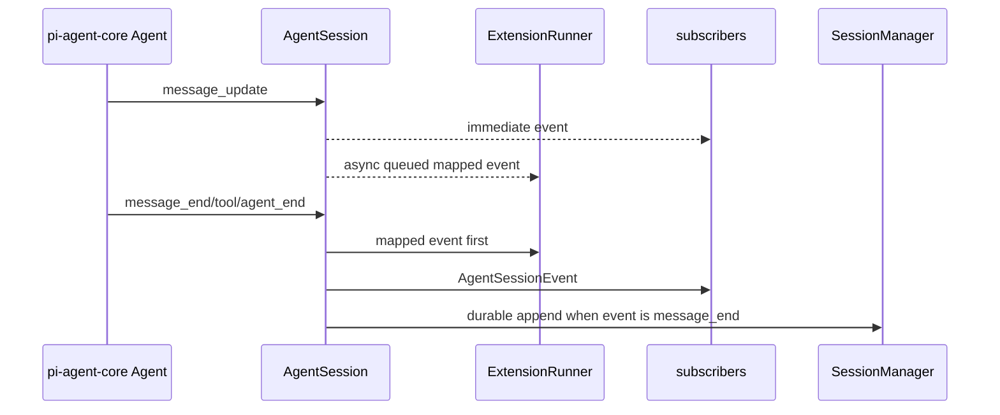

# Runtime and Session Flow

## Startup sequence

Citations: `runCli()` routes bare argv (`packages/coding-agent/src/cli.ts:53-67`); `runRootCommand()` performs root setup and dispatch (`packages/coding-agent/src/main.ts:716-1060`); `createAgentSession()` builds runtime dependencies (`packages/coding-agent/src/sdk.ts:794-2166`).

## Session manager selection

`createSessionManager()` maps CLI flags to storage behavior (`packages/coding-agent/src/main.ts:401-467`):

| Input | SessionManager path |
| --- | --- |
| `--fork <path/id>` | `SessionManager.forkFrom()` |
| `--no-session` | `SessionManager.inMemory()` |
| `--resume <path/id>` | `SessionManager.open()` or resolved resumable session |
| cross-project global resume | prompt to fork; refusal errors |
| `--continue` / auto-resume | `SessionManager.continueRecent()` |
| `--session-dir` without resume | `SessionManager.create()` |
| default | `undefined`; SDK creates a new manager |

## Prompt lifecycle

Important symbols:

- `AgentSession.prompt()` handles command dispatch, prompt-template expansion, streaming queueing, ultrathink notice, eager todo prelude, and plan-mode enforcement (`packages/coding-agent/src/session/agent-session.ts:3930-4026`).
- `#promptWithMessage()` flushes pending exchanges, restores retry fallback primary when needed, validates model/API key, builds per-turn messages, resolves file mentions, rebuilds system prompt, lets extensions mutate the turn, then runs the core agent (`packages/coding-agent/src/session/agent-session.ts:4059-4255`).
- `#handleAgentEvent()` persists message-end events and performs tool/goal/TTSR bookkeeping (`packages/coding-agent/src/session/agent-session.ts:1390-1825`).

## Event fanout

`#emitSessionEvent()` special-cases `message_update`: UI subscribers get it immediately while extension delivery is queued. Other events await extension mapping before subscriber fanout. `agent_end` can be held while prompt finalizers are still in flight (`packages/coding-agent/src/session/agent-session.ts:1360-1384`).

## Session switching and new sessions

- `newSession()` disconnects from the current core agent, aborts work, cancels owned jobs, closes provider sessions, optionally drops or flushes the old session, creates a new session file, persists thinking/service tier/MCP selection, clears queues, reconnects, and emits `session_switch` with reason `new` (`packages/coding-agent/src/session/agent-session.ts:4802-4905`).
- `switchSession()` emits cancellable `session_before_switch`, aborts and flushes, snapshots rollback state, loads the target session, restores MCP/tool/model state, emits `session_switch`, replaces agent messages from `buildSessionContext()`, and closes provider sessions when model/session changed (`packages/coding-agent/src/session/agent-session.ts:8235-8310`).

## Persistence flow

`SessionManager` maintains an append-only tree. Each entry has `id`, `parentId`, and `timestamp`; append moves leaf to the new entry. Branching moves the leaf without deleting history (`packages/coding-agent/src/session/session-manager.ts:57-253`, `packages/coding-agent/src/session/session-manager.ts:2880-3028`).

`_persist()` has two paths (`packages/coding-agent/src/session/session-manager.ts:2487-2533`):

- cold path: rewrite full JSONL atomically;
- hot path: synchronously prepare/truncate/externalize and append one JSONL line.

`buildSessionContext()` walks active leaf to root, folds model/thinking/service-tier/MCP/mode state, materializes compaction/branch/custom messages, and strips dangling tool-use blocks before LLM replay (`packages/coding-agent/src/session/session-manager.ts:506-775`).
