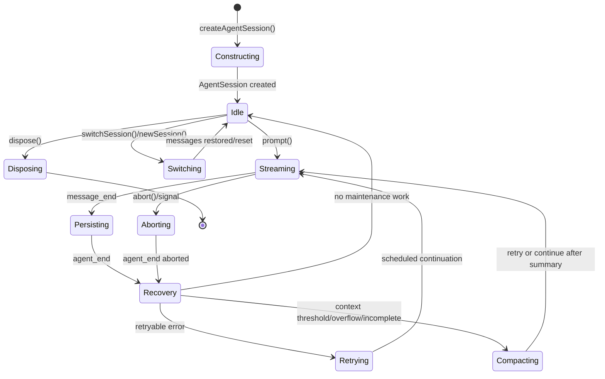
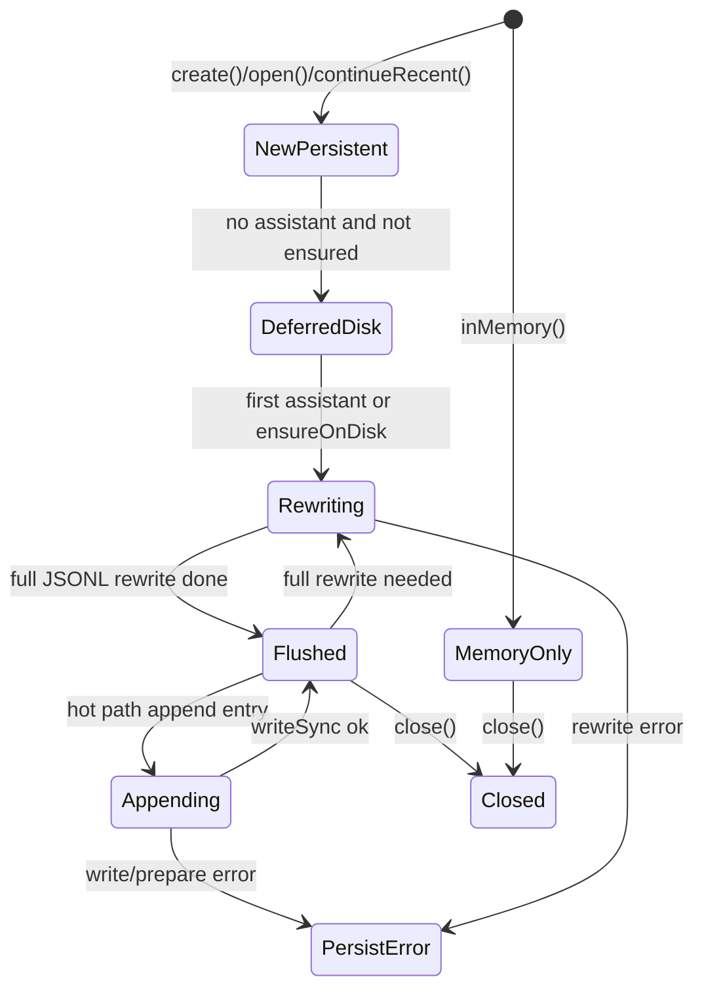
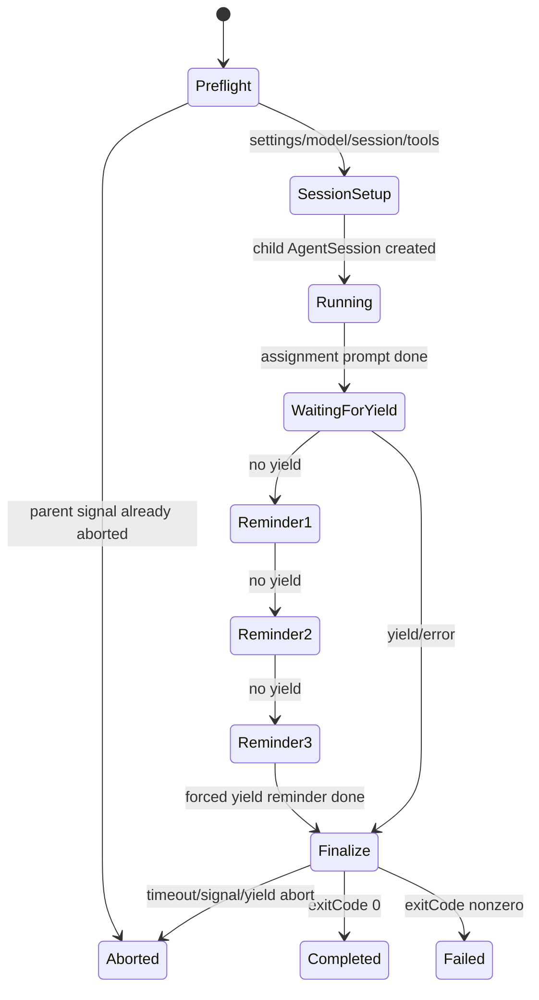
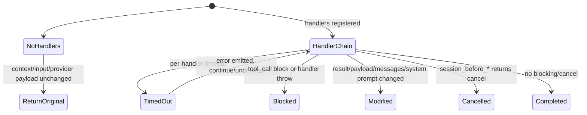
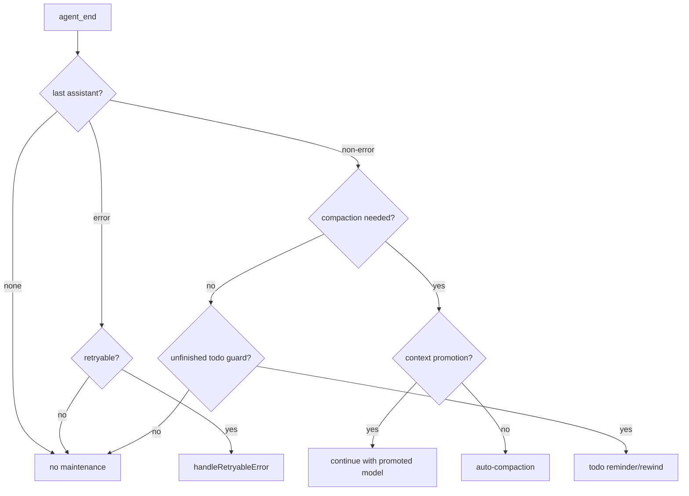
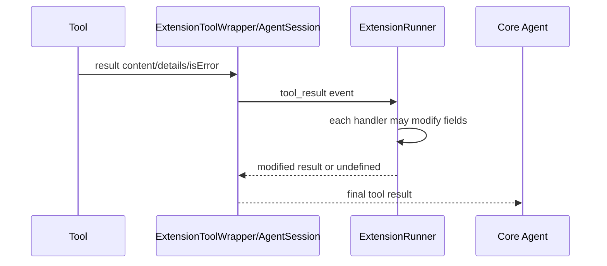

# State Machines

## Session lifecycle

Grounding:

- construction: `createAgentSession()` (`packages/coding-agent/src/sdk.ts:794-2166`);
- prompt path: `AgentSession.prompt()` and `#promptWithMessage()` (`packages/coding-agent/src/session/agent-session.ts:3930-4255`);
- event handling/recovery: `#handleAgentEvent()` (`packages/coding-agent/src/session/agent-session.ts:1390-1825`);
- session switch/new: `newSession()` and `switchSession()` (`packages/coding-agent/src/session/agent-session.ts:4802-4905`, `packages/coding-agent/src/session/agent-session.ts:8235-8310`);
- disposal: `dispose()` (`packages/coding-agent/src/session/agent-session.ts:2770-2810`).

## SessionManager persistence state

`SessionManager._persist()` chooses deferred, rewrite, or synchronous append paths (`packages/coding-agent/src/session/session-manager.ts:2487-2533`). Entries are append-only except explicit rewrite operations; branch changes move leaf pointer rather than deleting entries (`packages/coding-agent/src/session/session-manager.ts:2880-3028`).

## Subagent lifecycle

Grounded in `runSubprocess()` and `finalizeSubprocessOutput()` (`packages/coding-agent/src/task/executor.ts:615-1777`, `packages/coding-agent/src/task/executor.ts:302-393`).

## Extension event transformation

Grounding: `#runHandlerWithTimeout()` (`packages/coding-agent/src/extensibility/extensions/runner.ts:498-535`), generic `emit()` (`packages/coding-agent/src/extensibility/extensions/runner.ts:538-569`), `emitToolCall()` (`packages/coding-agent/src/extensibility/extensions/runner.ts:614-647`), and transform emitters (`packages/coding-agent/src/extensibility/extensions/runner.ts:571-899`).

## Retry and compaction decision order

`#handleAgentEvent()` runs retry before compaction and todo checks (`packages/coding-agent/src/session/agent-session.ts:1760-1825`). Retry and fallback are in `packages/coding-agent/src/session/agent-session.ts:6950-7588`; compaction/context promotion are in `packages/coding-agent/src/session/agent-session.ts:5780-5876`, `packages/coding-agent/src/session/agent-session.ts:6118-6185`, and `packages/coding-agent/src/session/agent-session.ts:6561-6868`.

## Tool result mutation path

`emitToolResult()` cumulatively applies content/details/isError changes (`packages/coding-agent/src/extensibility/extensions/runner.ts:571-612`). `emitToolCall()` can block pre-execution (`packages/coding-agent/src/extensibility/extensions/runner.ts:614-647`).
