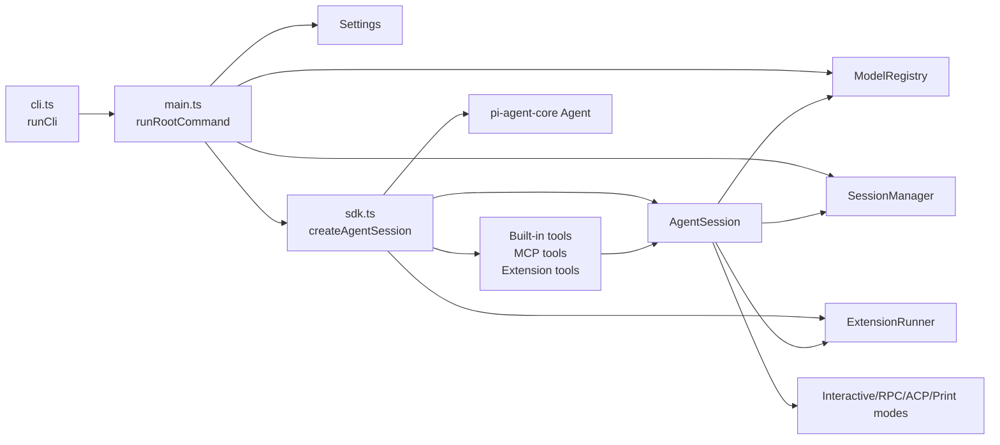
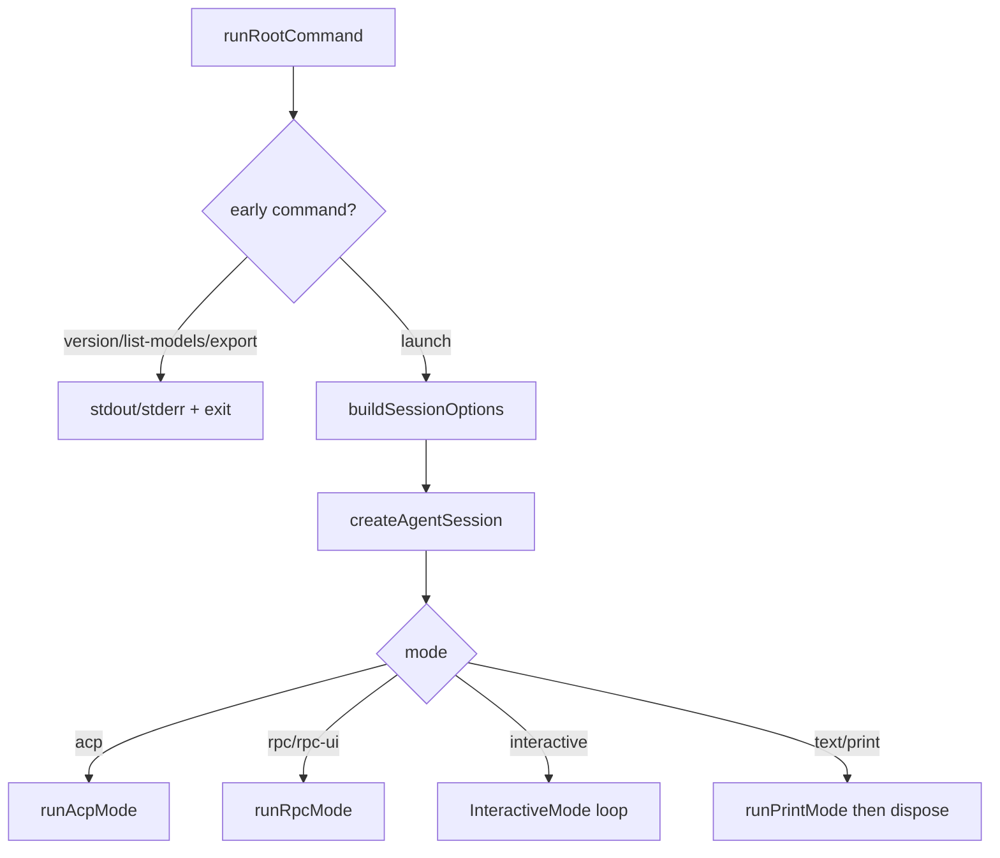

# System Overview

`packages/coding-agent` is the Lex/OMP CLI application. It turns argv, settings, credentials, extension discovery, tools, model selection, and session storage into an `AgentSession` around the core `Agent` loop.

## Main responsibilities

1. **CLI routing**: `runCli()` validates Bun, maps bare argv to `launch`, and delegates to the pi-utils CLI runner (`packages/coding-agent/src/cli.ts:53-70`).
2. **Root command orchestration**: `runRootCommand()` handles early commands, settings/auth/model registry setup, plugin preload, initial prompt construction, model scope, session manager selection, session creation, and mode dispatch (`packages/coding-agent/src/main.ts:716-1060`).
3. **Session creation**: `createAgentSession()` builds the shared runtime: `Settings`, `ModelRegistry`, `SessionManager`, tools, MCP, extensions, system prompt, `Agent`, `AgentSession`, async jobs, `AgentRegistry`, memory startup, LSP warmup, and MCP callbacks (`packages/coding-agent/src/sdk.ts:794-2166`).
4. **Runtime coordination**: `AgentSession` owns prompt submission, persistence, event fanout, extension event mapping, retry, compaction, model switching, queueing, and disposal (`packages/coding-agent/src/session/agent-session.ts:754`).
5. **Persistence**: `SessionManager` stores an append-only JSONL tree of session entries. Active branch is determined by leaf pointer, not whole-file linear order (`packages/coding-agent/src/session/session-manager.ts:57-253`, `packages/coding-agent/src/session/session-manager.ts:2880-3028`).

## Runtime ownership boundaries

- `main.ts` owns CLI-level decisions: mode, initial message, settings overrides, session manager choice, and whether missing model is fatal outside interactive mode (`packages/coding-agent/src/main.ts:823-1004`).
- `sdk.ts` owns construction-time dependencies and invariants. Notably, `authStorage` is pinned to `modelRegistry.authStorage`; mismatches throw because registry auth failures must route through the same storage instance (`packages/coding-agent/src/sdk.ts:802-813`).
- `AgentSession` owns live session mutation and must be disposed to unregister from `AgentRegistry`, unsubscribe credential handlers, close provider sessions, cancel owned jobs, and emit shutdown (`packages/coding-agent/src/session/agent-session.ts:2770-2810`, `packages/coding-agent/src/sdk.ts:2019-2032`).
- `SessionManager` owns durable JSONL and artifacts. Persistent sessions normally avoid disk creation until first assistant message unless explicitly ensured (`packages/coding-agent/src/session/session-manager.ts:2487-2510`).

## High-level mode dispatch

## Maintainer notes

- Bare CLI args become `launch`; do not debug root command behavior in `main.ts` before checking `runCli()` (`packages/coding-agent/src/cli.ts:58-67`).
- `createAgentSession()` starts many independent discoveries in parallel: workspace tree, context files, prompt templates, slash commands, skills, and model refresh (`packages/coding-agent/src/sdk.ts:833-867`). Bugs can look order-dependent; inspect await sites.
- Extension provider registration happens after extension load but before deferred `--model` resolution and fallback candidate selection (`packages/coding-agent/src/sdk.ts:1372-1432`).
