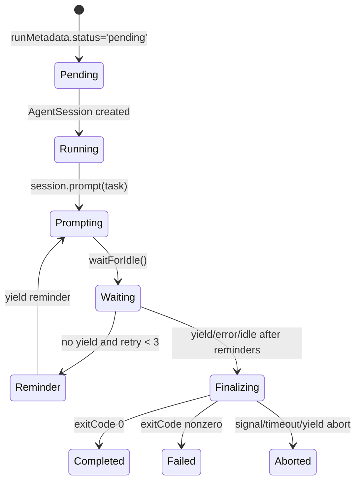
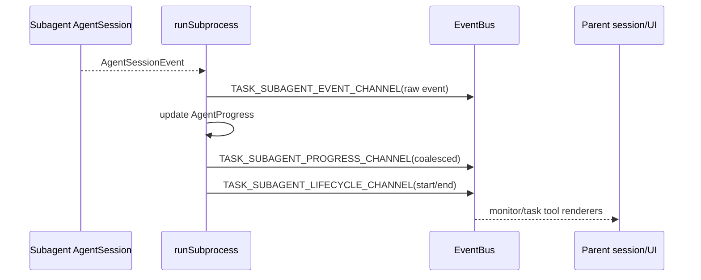

# Task Orchestration

Task orchestration runs subagents in-process through the task tool. It is not `/delegate`, acpx, tmux, or cmux.

## Public task contract

The task tool accepts an `agent`, parallel `tasks[]`, shared `context`, and optional JTD `schema`. Each task item has `id`, UI-only `description`, and subagent-visible `assignment` (`packages/coding-agent/src/task/types.ts`).

Core data shapes:

- `AgentDefinition`: agent name/source, model, tools, spawns, thinking level, output mode, blocking behavior (`packages/coding-agent/src/task/types.ts`).
- `ExecutorOptions`: parent-provided runtime dependencies and limits: cwd/worktree, model overrides, parent active model, task depth, LSP, event bus, context files, workspace tree, MCP manager, settings, shared auth/model registry, artifact manager, and telemetry (`packages/coding-agent/src/task/executor.ts:174-233`).
- `SingleResult`: terminal output, status/error/abort metadata, usage, artifact paths, extracted tool data, and run metadata (`packages/coding-agent/src/task/types.ts`).

## Subagent lifecycle

`runSubprocess()` is the orchestrator (`packages/coding-agent/src/task/executor.ts:615-1777`):

1. Initialize `AgentProgress` as running.
2. Return immediately if parent signal already aborted.
3. Create isolated subagent settings with async/background disabled (`packages/coding-agent/src/task/executor.ts:579-589`).
4. Enforce max recursion depth and optional wall-clock runtime cap.
5. Resolve model patterns, with auth-aware fallback to parent active model when possible (`packages/coding-agent/src/task/executor.ts:711-746`, `packages/coding-agent/src/config/model-resolver.ts:827-868`).
6. Open subagent transcript or in-memory `SessionManager`; adopt parent artifact manager when supplied (`packages/coding-agent/src/task/executor.ts:1235-1240`).
7. Create a child `AgentSession` with `requireYieldTool: true`, subagent prompt wrapping, parent context/skills/prompts/workspace tree, child agent identity, optional MCP proxy tools, shared local protocol, and inherited telemetry (`packages/coding-agent/src/task/executor.ts:1277-1322`).
8. Emit lifecycle `started`; subscribe to child `AgentSessionEvent`s.
9. Prompt the assignment, wait idle, send up to three yield reminders, then finalize.
10. Write output and manifest artifacts, emit final progress/lifecycle, and return `SingleResult`.

## Progress and EventBus channels

Progress is coalesced around a 150 ms window and flushed immediately on tool end and agent end. Recent output is kept as a bounded tail; recent tool history is capped (`packages/coding-agent/src/task/executor.ts:843-1132`).

## Yield and output contract

`finalizeSubprocessOutput()` defines how subagent output becomes task result (`packages/coding-agent/src/task/executor.ts:302-393`):

- last `yield` wins;
- `yield` with `status: 'aborted'` serializes aborted output and marks terminal result aborted later;
- null/undefined yield prepends `SUBAGENT_WARNING_NULL_YIELD`;
- valid yield serializes normalized data;
- `report_finding` tool output is merged into `findings` if absent;
- without yield, schema-compatible JSON fallback can satisfy result; otherwise missing-yield warning may force failure.

Subagents are forced toward the contract: after the first prompt, executor sends up to three reminders and uses `toolChoice: yield` on the final reminder when the model supports named tool choice (`packages/coding-agent/src/task/executor.ts:1437-1508`).

## MCP, tools, and recursion

- If `agent.spawns` is configured, `task` is auto-included unless max recursion depth is reached (`packages/coding-agent/src/task/executor.ts:689-701`).
- `exec` expands to `eval` when enabled plus `bash` (`packages/coding-agent/src/task/executor.ts:702-709`).
- Parent-owned `todo_write` is removed from subagent active tools after session creation (`packages/coding-agent/src/task/executor.ts:1343-1348`).
- When parent MCP manager is reused, subagents receive proxy custom tools that call existing MCP connections with a 60 s timeout (`packages/coding-agent/src/task/executor.ts:529-577`, `packages/coding-agent/src/task/executor.ts:1242-1243`).

## IRC and background jobs

Subagents are registered in the shared `AgentRegistry` before system prompt construction so peer rosters can include sibling agents in the same parallel batch (`packages/coding-agent/src/sdk.ts:1745-1758`). IRC uses those IDs for live side-channel replies; job tooling snapshots background tasks through the top-level `AsyncJobManager` (`packages/coding-agent/src/tools/irc.ts`, `packages/coding-agent/src/tools/job.ts`, `packages/coding-agent/src/sdk.ts:1100-1122`).
